# 第三章实验：HTTP代理服务器实验

## 实验要求

实验验证：在网关中安装tinyproxy，然后用主机设置浏览器代理指向tinyproxy建立的HTTP正向代理，在Kali中用wireshark抓包，分析抓包过程，理解HTTP正向代理HTTPS流量的特点。

## 实验环境

### 网络拓扑环境

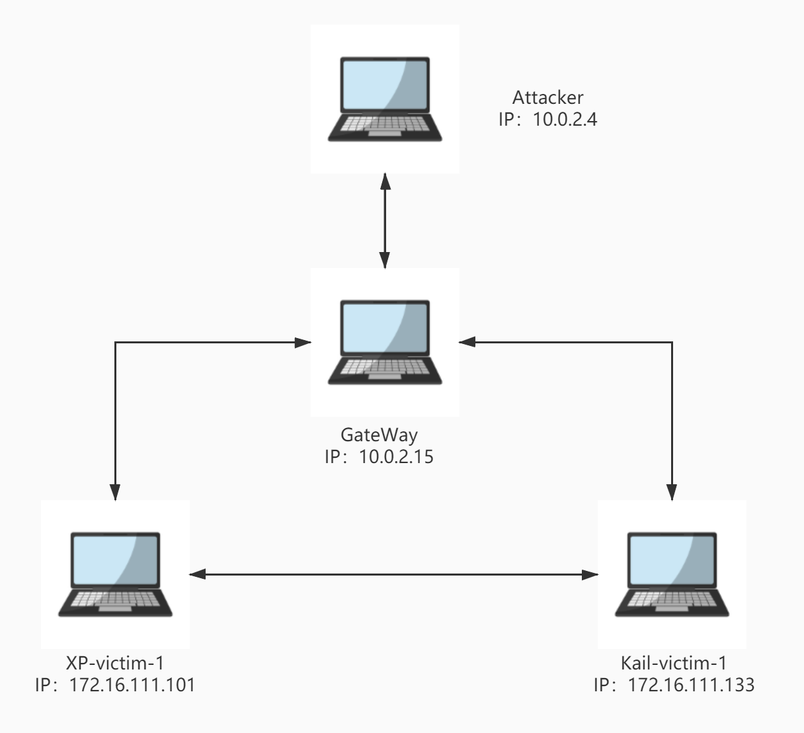

### 节点信息描述

  |   虚拟机名称    |      网卡选择      |          IP地址        |
  | :-------------: | :----------------: | :---------------:     |
  | Debian-Gateway  |  NAT网络，NatNetwork   |    10.0.2.15      |
  |                 | 内部网络，intnet-1 |  172.16.111.1         |
  |   xp-victim-1   | 内部网络，intnet-1 |  172.16.111.101       |
  |   kali-victim-1 | 内部网络，intnet-1 |  172.16.111.133       |
  | attacker-intnet |  NAT网络，NatNetwork   |   10.0.2.4        |

### 连通性说明及验证

+ 攻击者无法ping通靶机

  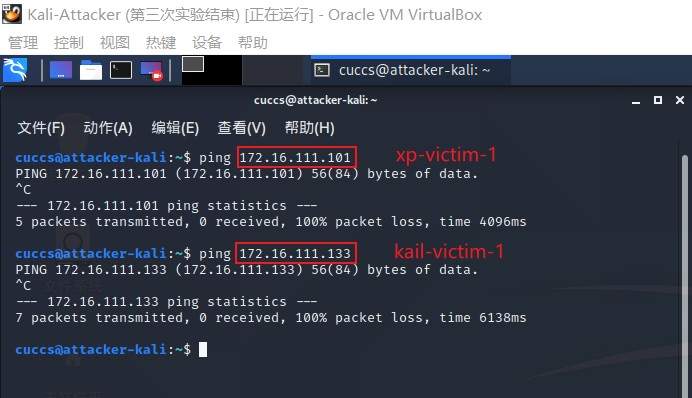

+ 靶机可以ping通攻击者

  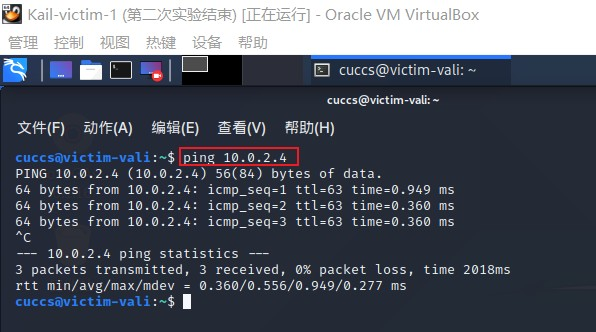

  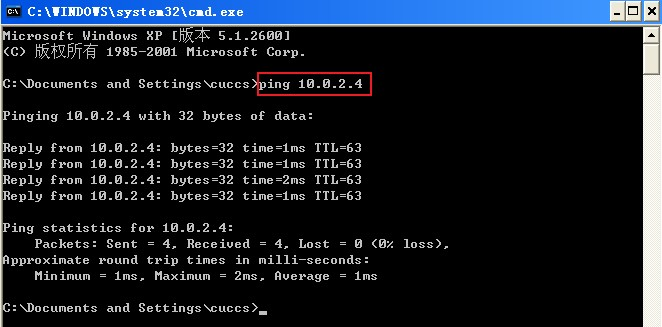

+ 攻击者可以上网且可以访问网关

  

+ 网关可以ping通攻击者和靶机

  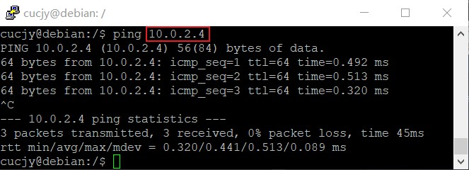

  
  
## 实验前的准备

在网关上安装tinyproxy：

准备修改配置文件，首先做个备份以防万一：

然后打开文件`/etc/tinyproxy/tinyproxy.conf`，去掉注释`Allow 10.0.0.0/8`，目的是允许NAT网络内的节点使用网关的代理服务（就是攻击者网关）

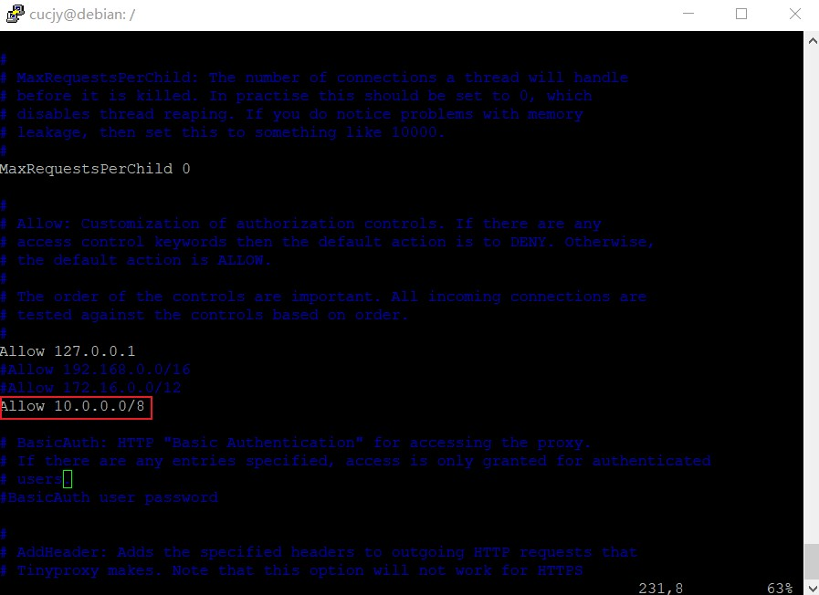

## 实验步骤

首先在网关打开tinyproxy服务：

再在攻击者浏览器中设置代理，地址为网关地址，端口为默认端口8888：

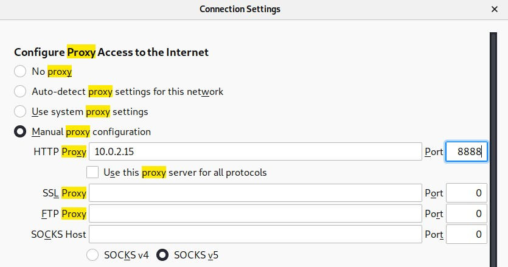

攻击者尝试在浏览器访问靶机，遇到了连接错误：

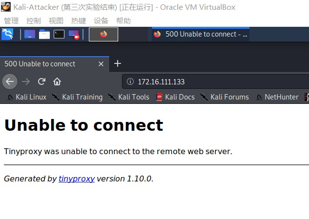

猜测原因是web服务器还未开启，在靶机开启apache服务：

猜测属实，现在已经可以成功访问了：

### 实验验证一：正向代理对攻击者身份的隐藏效果

现在开始正式的抓包分析实验，在靶机中进行抓包：

同时攻击者在浏览器访问靶机：

查看抓包结果，过滤掉除http以外的其他信息，可以观察到Via字段已经记录下了tinyproxy的代理信息，攻击者的IP地址、以太网接口等信息均未暴露：

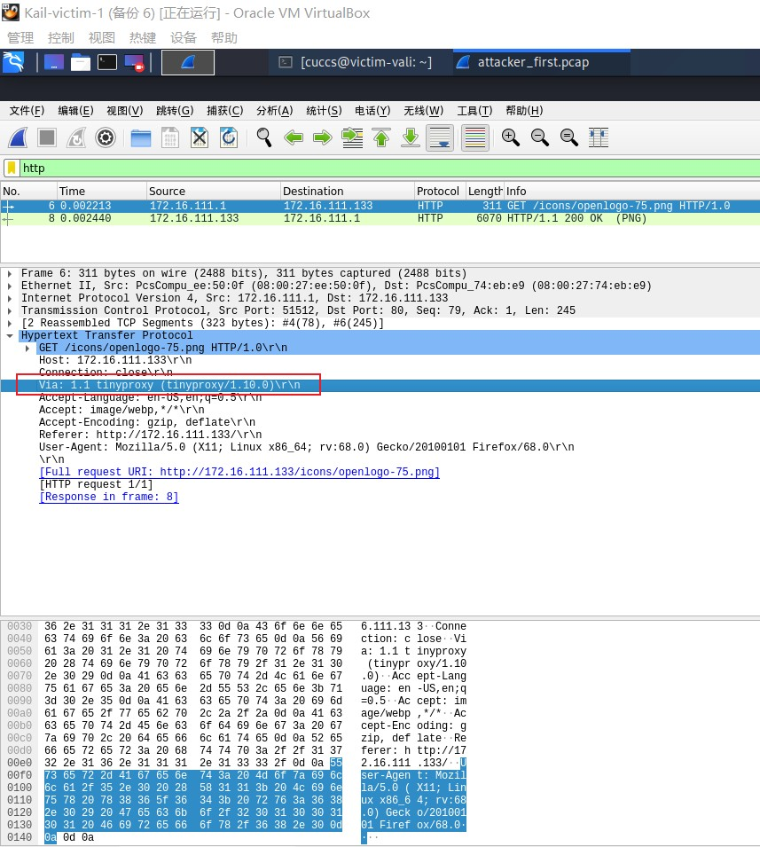

### 实验验证二：正向代理对通信传输内容的隐藏效果

攻击者访问https站点如百度和知乎：

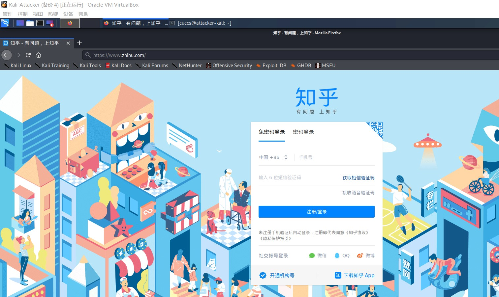

与此同时在网关进行抓包：

完毕以后把数据传输到本机以便进行分析：

以下为抓包结果，可以看出代理服务器不知道客户端和服务器的HTTPS通信内容(HTTP报文经过加密)，但知道客户端访问了哪个HTTPS站点：

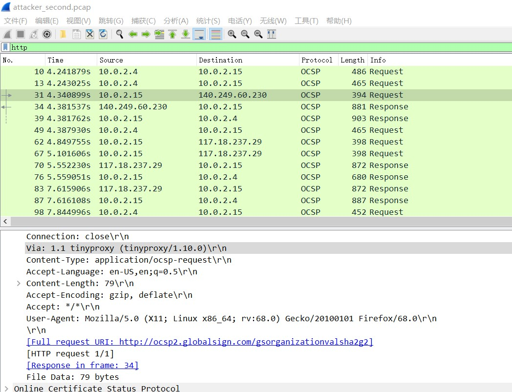

## 实验结果分析及结论

正向代理可以做到：
+ 访问原来无法访问的资源，如google

+ 做缓存，加速访问资源

+ 对客户端访问授权，上网进行认证

+ 记录用户访问记录，对外隐藏用户信息

HTTP正向代理HTTPS流量的特点：

+ 作为正向代理在处理客户端发过来的流量时，HTTP加密封装在了TLS/SSL中，代理服务器无法看到客户端请求URL中想要访问的域名。

## 参考资料

[网络安全教程第三章](https://c4pr1c3.github.io/cuc-ns/chap0x03/exp.html)

[师姐文档](https://github.com/CUCCS/2019-NS-Public-chencwx/blob/ns_chap0x03/ns_chapter3/HTTP%E4%BB%A3%E7%90%86%E6%9C%8D%E5%8A%A1%E5%99%A8%E5%AE%9E%E9%AA%8C.md)